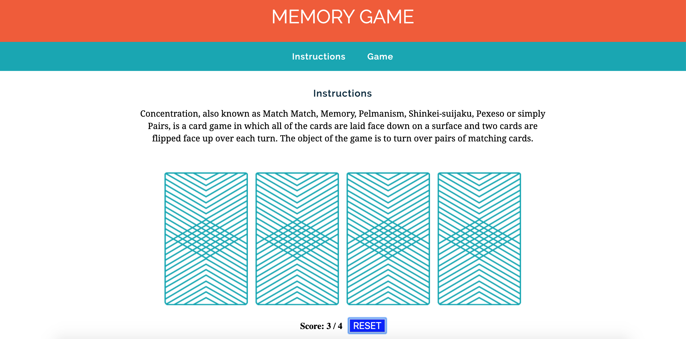

# wdi-fundamentals-memorygame
### Front End game made for general assembly

It's a matching game. Only 4 cards. Goal is to match them. Tally's your score.

Link: https://xhaferllari11.github.io/wdi-fundamentals-memorygame/

Screenshot: 

